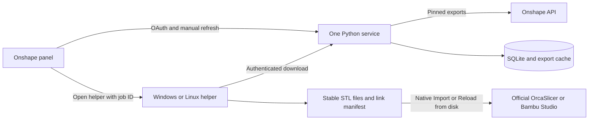

# Stock-slicer application

The supported direction is one hosted Onshape application and one small desktop
helper. The slicers are official installations. The older native fork experiment
remains in the repository as reference.

## What lives where

`slicer_link/model.py` defines source identity and binary STL validation.
`files.py` owns local file transactions and recovery. These have no desktop or
web dependencies. `onshape.py` owns CAD requests and persistent immutable export
caching. `auth.py`, `store.py`, and `service.py` form the hosted application.
`web/` is plain HTML, CSS, and JavaScript, with no frontend build toolchain.
`helper.py` provides the short setup and transfer windows. `platforms.py` contains
the Windows and Linux integration.

The service runs one process with a persistent SQLite database and mesh cache.
It serializes exports, sharing revision checks and cached geometry across requests
for both slicers. A job interrupted by a service restart fails visibly; the user
can refresh again. Do not add multiple Uvicorn workers to this design.

The helper runs on demand. It keeps a computer token in the native desktop
credential store, configuration in the user's app settings folder, and project
metadata beside the models. The URI contains only a job ID. It cannot supply an
arbitrary download URL, command, or local destination.

## Source identity and refresh

Choose parts fetches a Part Studio catalog at one immutable document microversion.
A link retains that document, workspace, element, configuration, microversion,
and part ID. Names are labels. A refresh checks the current microversion once per
document/workspace, translates old part IDs when needed, and exports that immutable
target snapshot. Missing or ambiguous translations fail without replacing files.

The helper downloads and validates all required files before replacing any source.
Each source has a permanent ASCII filename with a unique link ID. Per-folder
locking, atomic single-file writes, a recovery journal, and cached previous geometry
protect interrupted updates. Older queued transfers cannot replace newer downloads.
An acknowledged job can be retried without applying it again.

Never read or rewrite the user's `.3mf` in product code. The slicer owns project
settings and geometry in memory. The app reports files ready to reload; it cannot
verify unsaved slicer state. Native reload may recenter new geometry and applies
the slicer's bed-placement rules. Supports, seams, and other geometry-dependent
settings need user review.

## API allowance

Onshape does have annual API allowances. Its published table lists 2,500 calls
per year for Free, Standard, and EDU Student users; 5,000 per company user for
Professional; and 10,000 per full company user for Enterprise. Private OAuth
app traffic counts against the application owner. Public App Store OAuth apps
are exempt from annual allowance accounting but retain rate limits.
[Onshape API limits](https://onshape-public.github.io/docs/auth/limits/)

The app never polls Onshape in the background. An unchanged refresh normally
makes one revision request per distinct document/workspace. Browser job-status
checks and helper transfer-status checks contact this service only. CAD exports
are shared between slicers. Successful HTTP request accounting is recorded locally,
including export redirects; this is an app diagnostic, not an authoritative
remaining Onshape balance. Check My account > Developer for the account allowance.

## Operational limits

This first version supports up to 100 solid-part links per account and bounded
binary STL downloads of 32 MiB per part. It excludes assemblies, sheet bodies,
composites, and mesh bodies from selection. Large models may require a larger
host plan. The cache currently retains immutable exports; monitor disk use and
increase storage when needed. CAD and print operations are always user initiated.

Keep the database, mesh directory, and server encryption key backed up together.
Losing the encryption key requires reconnecting Onshape accounts. Device tokens
can be revoked from the panel. The service uses opaque sessions instead of
third-party cookies, validates browser origins, and restricts download access to
the job's account and paired computer.

## Maintaining it

`uv.lock` pins dependencies. `packaging/requirements-server.txt` is its hashed
server export. Update them together, run the focused Windows checks, and build
the helper again. Package each desktop version on its target OS. Linux tests are
explicitly waived by Leo; packaging support is retained without a tested-distro claim.

The first user test should cover a new link, a CAD change, native reload, project
reopen, and restore using an ordinary print project. [Current evidence](stock-verification.md)
separates actual live/stock results from simulated integration tests.
