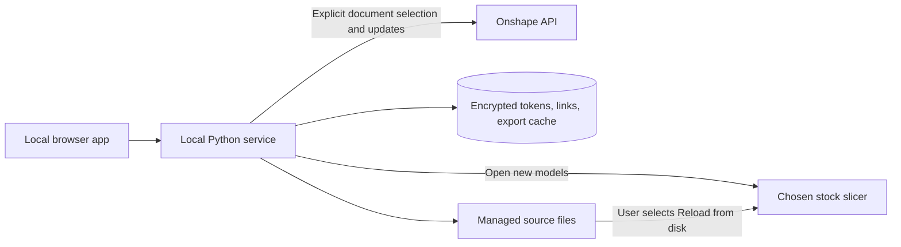

# Local slicer connection

One local process serves the browser UI, talks to Onshape, manages source files,
and opens the selected stock slicer. It binds only to 127.0.0.1. There is no hosted
service, public tunnel, paired helper, or paid infrastructure in the supported path.

## User workflow

The user chooses a detected OrcaSlicer or Bambu Studio installation. A native
file picker handles portable executables and AppImages. Document selection accepts
an Onshape document or Part Studio link, resolves readable document and tab names,
and remembers the exact workspace and Part Studio. A general document link uses
the default workspace. Saved versions are rejected for this editable link workflow.
The part list is scoped to the selected document and workspace.

Send / Update validates and saves every selected model, then opens only parts
not previously handed to that slicer. Source folders and import histories are
separate for each account and slicer. The app does not alter slicer binaries,
preferences, projects, arrangement, support painting, slicing, or printing.
A slicer can show its own import prompt or choose an existing/new window according
to its ordinary open-file behavior. Process launch is not proof of successful GUI
import; the UI calls it a handoff and tells the user to finish native prompts.

Existing parts require native Reload from disk. Repeated sends do not import
copies, even if a request is retried after a lost response. An interrupted launch
is reported as uncertain; the app does not blindly retry a potentially completed
import. Open selected parts again is an explicit recovery operation.

Saved 3MF files may store source basenames rather than absolute paths. Connect
saved project records a user-chosen 3MF location. Later sends mirror managed source
files beside it so native reload can find them after reopening. The application
never rewrites the 3MF, and refuses to overwrite unrelated or externally edited
source files. If the project moves, reconnect its new location. Only one saved
project per document/workspace/slicer is connected at a time.

## Code ownership

- `local.py`: packaged process lifecycle, first connection, native password store,
  reopen existing process, and native file picker subprocess.
- `local_service.py`: authenticated local document, slicer, project, and send routes.
- `documents.py`: strict Onshape URL parsing and explicit document/tab lookup.
- `sync.py`: export, durable file application, stock process launch, import history,
  saved-project source copies, and retry handling.
- `onshape.py`, `files.py`, `model.py`, `store.py`, `auth.py`: shared export cache,
  geometry checks, crash recovery, SQLite persistence, and OAuth.
- `web/local.*`: the local user interface, with no frontend build tool.

The earlier hosted panel and helper remain for reference and shared tests.
The installer entry point is `slicer_link.local`, not the hosted helper.

## Requests and persistence

No idle Onshape polling. Connecting a document uses two requests for its metadata
and tabs. Choosing parts uses a pinned snapshot catalog. Sending uses one current
revision check per source workspace and reuses immutable exports when possible.
The verified unchanged live refresh uses one Onshape request. Opening the app and
restoring saved UI choices makes no CAD requests.

Onshape has annual allowances as well as rate limits. Successful private OAuth
requests count against the owning user's/company's allowance; public App Store
applications have different annual treatment. The app records its successful
requests and handles 402/429 without a retry storm.
[Onshape limits](https://onshape-public.github.io/docs/auth/limits/).

Tokens are encrypted in SQLite. The key and private application credentials live
in Windows Credential Manager or Secret Service/KWallet. Browser sessions are
opaque, temporary, and bootstrapped through one-use codes. Host and Origin checks
protect loopback actions. No browser input becomes an arbitrary command or URL.
CAD requests go only to the Onshape API client.

File replacement is atomic per file with journal recovery. Managed folders are
validated before writes. A saved-project mirror failure can occur after the main
managed source folder has updated; the send is reported failed and no new slicer
launch occurs. A later explicit send can complete the mirror safely.

## Current limits

The app uses a separate local browser window. Embedding in Onshape's HTTPS iframe
is still outstanding. Stock slicers do not expose a verified remote replacement
interface for unsaved objects, so native reload remains a user action.

Windows packaging and execution are verified. Linux source and packaging are
provided but Linux execution is explicitly untested. Flatpak launches request
read-only access to their managed source folder without persistent overrides.
Large exports may need substantial memory; model exports are limited to 32 MiB.
